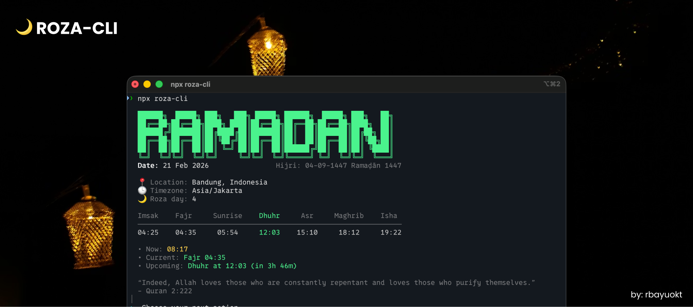

# Roza CLI

<br/><br/>

Roza CLI is a clean, minimal terminal app for Ramadan schedules and prayer tracking.

## Features
- Automatic first-run setup with location detection, methods, and timezone
- Daily prayer schedule with a clean table and current/upcoming highlights
- Home shows a random Quran quote
- Interactive menu after Home for quick actions
- Prayer attendance tracking (mark today’s prayers)
- Backfill past dates with validation and reminders
- Ramadan-only history view with Hijri date range
- Ramadan statistics recap with consistency summary and grid visualization
- Works with the Aladhan API

## Install

Global (recommended):

```sh
npm install -g roza-cli
roza-cli
```

Without install:

```sh
npx roza-cli
```

## Getting Started (Local Dev)

```sh
npm install
npm run build
npx roza-cli
```

## Local Commands (Dev)

```sh
node dist/cli.js schedule   # show schedule
node dist/cli.js mark       # mark today’s prayers
node dist/cli.js backfill   # update past date
node dist/cli.js history    # view attendance history
node dist/cli.js recap      # recap consistency
node dist/cli.js reset      # reset config
```

## Ramadan History & Statistics

```sh
node dist/cli.js history --ramadan
node dist/cli.js recap --ramadan
```

## Reset Config

```sh
node dist/cli.js reset
```

## License
MIT

Inspired by: https://github.com/ahmadawais/ramadan-cli

Made with ❤️ and 🎵 by @rbayuokt
